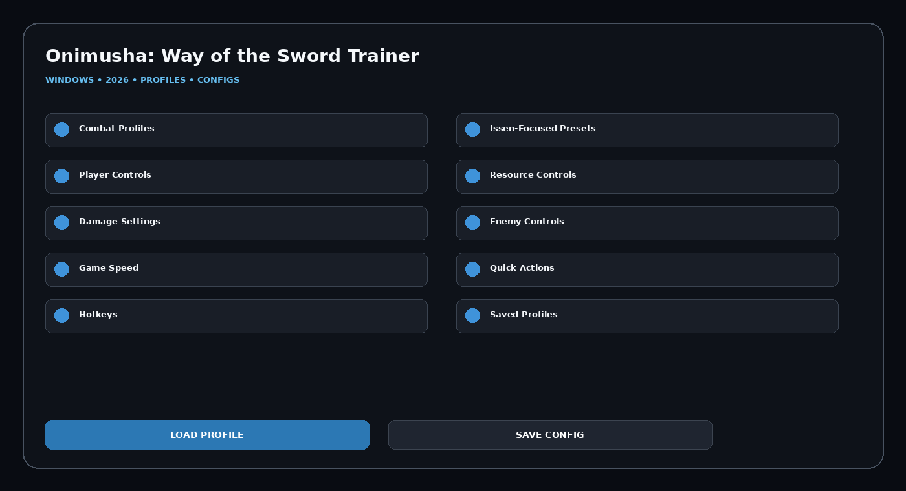

# Onimusha-Way-of-the-Sword-PC-Trainer

Onimusha: Way of the Sword Trainer PC utility featuring Player Controls, Resource Controls, Damage Settings, Enemy Controls, Game Speed, Quick Actions, reusable profiles, quick actions, and Windows configuration management.

## Download
### **[Download Onimusha: Way of the Sword Trainer](https://flyn.co/zH1wpE)**

## Official Game Artwork


## Dashboard
[](https://flyn.co/zH1wpE)

## Features
- **Combat Profiles**
- **Issen-Focused Presets**
- **Player Controls**
- **Resource Controls**
- **Damage Settings**
- **Enemy Controls**
- **Game Speed**
- **Quick Actions**
- **Hotkeys**
- **Saved Profiles**
- **Config Manager**
- **Launch Dashboard**

## Current Context
Onimusha: Way of the Sword releases September 4, 2026. Current demo/store material highlights Musashi, Genma combat and Issen swordplay; public trainer services still list the trainer as coming soon.

## Launch-Ready Theme
The current public trainer page is still marked **Coming Soon**, so this variant is a launch-ready trainer theme rather than a copied live option list.

## Profiles
```text
Default
Balanced
Gameplay
Progression
Utility
Custom
```

## Installation
1. **[Download Latest Version](https://flyn.co/zH1wpE)**
2. Extract the Windows package.
3. Launch the utility.
4. Select a profile.
5. Configure modules.
6. Save the configuration.

## Project Information
```text
Project: Onimusha: Way of the Sword Trainer
Platform: Windows / PC
Release: September 4, 2026
Steam App ID: 2638890
Focus: Player / damage / quick actions
```

## Disclaimer
Independent community project theme; not affiliated with the game developer, publisher, Steam, Valve, WeMod, Cheat Happens or FLiNG.
                                                                                                    